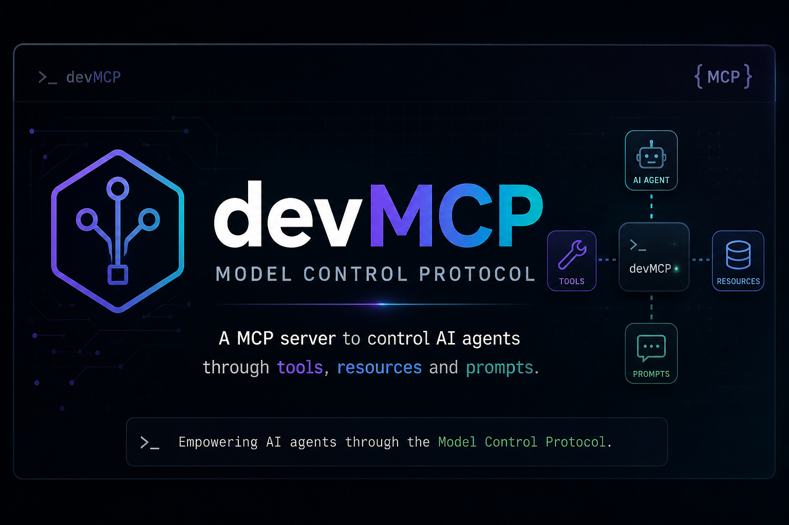

<p align="center">
  
</p>


# devMCP

Modular Model Context Protocol (MCP) development server for local/offline coding agents, featuring a Telegram bot for remote management.

## Overview

devMCP provides a suite of tools and workflows designed for autonomous coding agents. It follows a modular architecture where basic tools (CLI wrappers) are composed into higher-level "skills" (workflows).

### Core Components

- **`server.py`**: The main entry point for the FastMCP server. It listens on `0.0.0.0:8000` using the `streamable-http` transport.
- **`telegram_bot.py`**: A standalone service providing two-way communication between the developer and agents via Telegram. It supports status checks, deployment, and delegation to agents like Kimi, Gemini, and Codex.
- **`registry.py`**: Manages the registration of all tool and skill modules into the MCP server.
- **`core/runtime.py`**: Shared utilities for command execution, file management, state (memory), and tool auto-installation.

## Architecture

```text
/
├── server.py             # FastMCP Entry Point
├── telegram_bot.py       # Telegram Interface
├── registry.py           # Module Registration
├── core/                 # Shared Runtime & Helpers
├── tools/                # Atomic Tool Wrappers (git, docker, files, etc.)
└── skills/               # Multi-step Workflow Tools
```

## Setup & Run

### 1. Configure Environment

Copy the example environment file and fill in your credentials:

```bash
cp .env.example .env
# Edit .env and add your TELEGRAM_TOKEN and TELEGRAM_CHAT_ID
```

### 2. Prerequisites

- Python 3.10+
- Virtual environment (recommended)
- Tools like `docker`, `git`, `ripgrep`, etc. (the server will attempt to auto-install missing dev tools)

### 3. Running the MCP Server

```bash
/home/$user/mcp-dev-server/.venv/bin/python3 server.py
```

### Running the Telegram Bot

```bash
/home/$user/mcp-dev-server/.venv/bin/python3 telegram_bot.py
```

## Available Toolsets

Tools are categorized by their function in the `tools/` directory:

- **Filesystem**: `files.py` (read, write, replace, list, search, glob, etc.)
- **Git**: `git.py` (status, diff, log, commit, push, pull)
- **Docker**: `docker.py` (logs, ps, restart, build, deploy, audit)
- **Languages**: `python_dev.py`, `javascript_dev.py` (linting, formatting, type checking)
- **Quality & Security**: `quality.py`, `security.py` (complexity, dead code, secrets, vulnerability scans)
- **Infrastructure**: `database.py`, `network.py`, `remote.py` (SQL/Redis queries, port scans, SSH management)
- **Agents & Memory**: `agents.py`, `memory.py` (delegation, persistent key-value store)

## Skills (Workflows)

Higher-level tools found in `skills/`:

- **`ops_workflows.py`**: CI debugging, PR reviews, dependency upgrades, Docker optimization, incident triage.
- **`project_health.py`**: Broad project health checks, status reports.
- **`scaffold.py`**: Creating new tool and skill templates.
- **`workflows.py`**: Common multi-step tasks like release note generation.

## Telegram Commands

The bot supports direct commands and agent delegation:

- `deploy <project>`: Local build and restart.
- `status <project>`: Docker compose status.
- `logs <project> <service>`: View service logs.
- `git status/pull/push`: Git operations.
- `memory list/get`: Access agent memory.
- `kimi: <prompt>`, `gemini: <prompt>`, `codex: <prompt>`: Delegate tasks to specific agents.
- `<anything else>`: Sent to Codex as a plain prompt.
